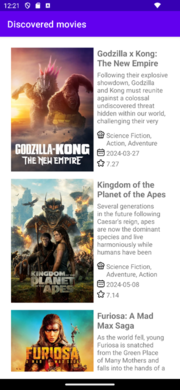
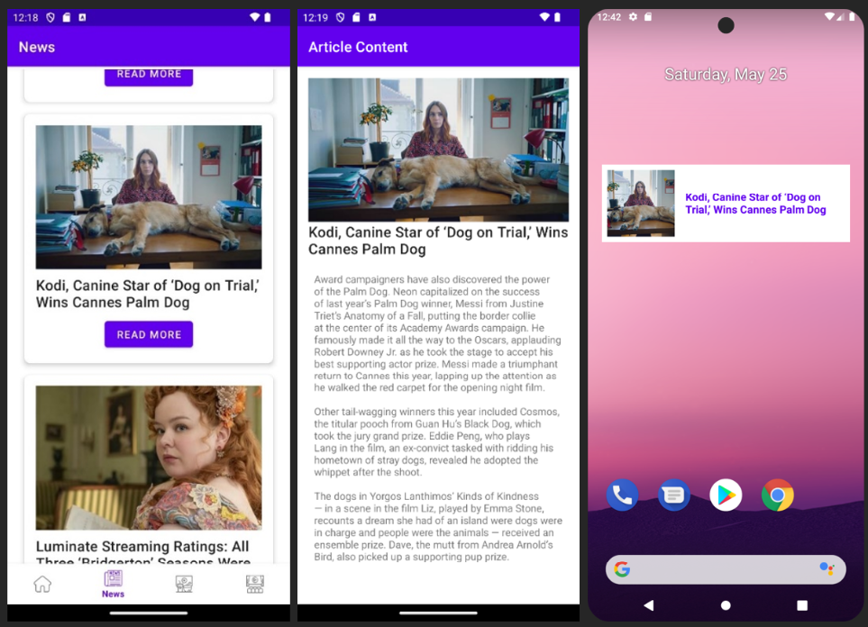

# Cinemax - Movie Guide

## Overview

Cinemax is a **mobile application** developed for **Android**, designed to provide a **comprehensive and seamless experience** for movie enthusiasts. This project was developed as a **team collaboration**, integrating expertise in **mobile development, API integration, and real-time data processing**.

The application allows users to **discover movies, access real-time film industry news, locate nearby cinemas, and personalize their watchlists**. With a modern and **intuitive interface**, Cinemax ensures an engaging and user-friendly experience.

## Features

- **Movie Discovery**: Browse a vast collection of films with **detailed descriptions, trailers, and ratings**.
- **Real-Time News**: Get the latest updates, reviews, and exclusive articles from the movie industry.
- **News Widget**: Automatically refreshes every **60 seconds**, keeping users updated on the latest headlines.
- **Cinema Locator**: Find nearby cinemas and view available screenings.
- **Personalized Experience**: Save favorite movies and receive tailored recommendations.
- **User-Friendly Interface**: Clean and modern UI with **smooth navigation and accessibility features**.
- **Offline Support**: Store selected articles and movie details for access without an internet connection.

## Technologies Used

- **.NET MAUI** - Cross-platform framework for mobile development.
- **REST APIs** - Fetching movie metadata, cinema locations, and news updates.
- **SQLite** - Local storage for user preferences and offline access.
- **Web Scraping** - Collecting structured data from various film industry sources.
- **Dependency Injection** - Efficient management of services and resources within the app.
- **MVVM Architecture** - Ensuring scalability and clean code organization.

## Project Structure

- `App.xaml.cs` - Core application logic and navigation.
- `Views/` - UI components for different app sections.
- `Models/` - Data models representing movies, cinemas, and user preferences.
- `Services/` - Handles API requests, data processing, and database operations.
- `Assets/` - Contains images, icons, and UI elements.

## Setup & Installation

To run Cinemax on your local machine, follow these steps:

1. **Clone the repository**:
   ```bash
   git clone https://github.com/galbinasuana/Cinemax-MovieGuide.git
   ```
2. **Open the project in Visual Studio**.
3. **Ensure .NET MAUI is installed** and restore dependencies.
4. **Run the application** on an **Android emulator or a connected physical device**.
5. **Explore features** such as trending movies, curated lists, and industry updates.

## Preview

The following images showcase different aspects of the application:

### Home Screen

Displays featured movies and trending content.


### Movie Details

Detailed view of a selected movie with description, ratings, and options to add to favorites.




### News Section

Stay informed with real-time updates, reviews, and the latest trends in the film industry.
The **news widget** automatically refreshes every **60 seconds**, ensuring the latest headlines are always visible.




### Cinema Locator

Find nearby cinemas and check available screenings.


